```{r setup, include=FALSE}
knitr::opts_chunk$set(echo = TRUE)
```

# Theoretical overview

In the first chapter of this work I will be outlining and explaining the theoretical concepts behind the algorithm.
As a hybrid technique that combines neural networks with clustering algorithms, both of these aspects will be covered, as well as a summary of the data types used and the drawbacks of modern image processing paradigms.

## Machine learning

Machine learning is the field of computer science dealing with creating a data model (through statistical and mathematical techniques) in order to "learn" a pattern or relationship: providing useful predictions, mapping one form of data to another, or even creating new items that fit the model.

While explicitly programmed models do exist, and were widely used before the advent of AI, "machine learning" specifically refers to emergent, self-improving models whose accuracy increases proportionally with the amount of realistic data introduced as an input. [@checkml]

The term "machine learning" was coined by Arthur Samuel in 1959, and includes a wide variety of "theme-blind" algorithms (each algorithm has advantages and disadvantages related to a certain statistical situation such as number of data points and dimensions, rather than a concrete, real-world scenario such as image recognition, house pricing, etc.).

### Types of learning

One way to classify ML tasks takes into account the form of the data used as input. Depending on whether or not the "target" value is included, we can have:

 - **Unsupervised learning** refers to algorithms that try to find structure in data without an explicit classification. This can be useful in dimensionality reduction (reducing the quantity of data without losing meaningful information) or as a goal in itself (finding non-trivial patterns in data by the human interpretation of a structured output).

 - **Supervised learning** on the other hand refers to algorithms that use labelled data: items with a certain class or score assigned beforehand. Usually, the goal of this type of learning is to map inputs to outputs: data samples collected after the training have to be appropriately evaluated to a certain class, score or probability.

### Uses of machine learning

Another way to classify ML tasks is looking at the desired result of using the model:

 - **Regression** and **classification** are a mapping of an input to an output, a continuous or a discrete one, respectively. Typically, this is done by creating a model to approximate a mapping function, for example from the area and location of a house to its price, or from an image's pixel data to whether or not it contains a human face (probabilistically).
    - **Linear regression** creates a data model that predicts a response given a certain input. The loss function to be minimised is often the "mean square error", describing how far the emerging model is from the input data.
    - **Artificial neural networks**, described in more detail in the next section, perform multiple transformations of a feature vector through a combination of nonlinear activation functions and cost minimisation.
 - **Dimensionality reduction**, as mentioned above, is meant to extract only the meaningful / statistically significant parts of the data. This is also a form of approximating a mapping function, as a number of dimensions are transposed onto a space with fewer dimensions. For example, a house's price could be heavily influenced by location and size, but not by colour.
    - **MDS**, or multi-dimensional scaling creates a distance matrix between observations, and then optimises their placement in a lower-dimension space such that the relationships between data points, the pair distances, are preserved. Over several iterations, a loss function descriribing the "strain" or information loss of the new mapping is minimised.
 - **Clustering** groups data points by similarity, through various metrics or goals. Certain clustering algorithms may normalise features and use a distance metric like Euclidian or Manhattan distance, while others seek to minimise a certain cost of merging clusters.
    - **K-means** initialises a finite number of centroids that converge to a certain solution over several iterations of the following cycle: data points are assigned to the nearest centroid, then the centroids are re-assigned to the average position of their cluster.
    - **DBSCAN** is a density-based clustering algorithm that takes into account the distance between data points. Clusters are initialised on existing observations one at a time, and neighbours within a certain range become seeds for that cluster themselves. Recursively, the clusters expand until all points have been visited (when a certain cluster is identified, new clusters are seeded from the remaining data points)
 - **Density estimation** tries to estimate the distribution of data in its feature space. Probabilistic models suitable for this will assign a certain density to any point in the space that describes how likely it is that new data will match a given interval of parameters.
    - **Kernel density estimation** is one such technique, where a *bandwidth* (smoothing parameter) is used to estimate densities by sampling "windows" of the data space.
 - **Reinforcement learning** dynamically assigns scores to an agent's decisions as it navigates an environment, in the form of positive or negative feedback. Through experimentation and memorisation of experiences, the agent can adapt to the environment (a board game, for example) to maximise reward without mapping the entire decision space.
    - **Q-learning** is a technique that aims to find the optimal action to take from a given state, while taking into account both short-term and long-term rewards.
 

 
## Artificial Neural Networks

Artificial neural networks are computational models inspired by their biological counterparts, found in animal brains [@neuroasbio].

As a machine learning subclass, these algorithms learn from data over time, in the form of adjusting various parameters found in the neurons, or computational units of the networks. Most commonly, this is done by increasing or decreasing multipliers used in transforming the data from its initial dimensionality to the desired output. Whether this is a plain classification problem, dimensionality reduction, or some other machine learning task, artificial neural networks operate with progressively altering the data through several stages.

### The Perceptron

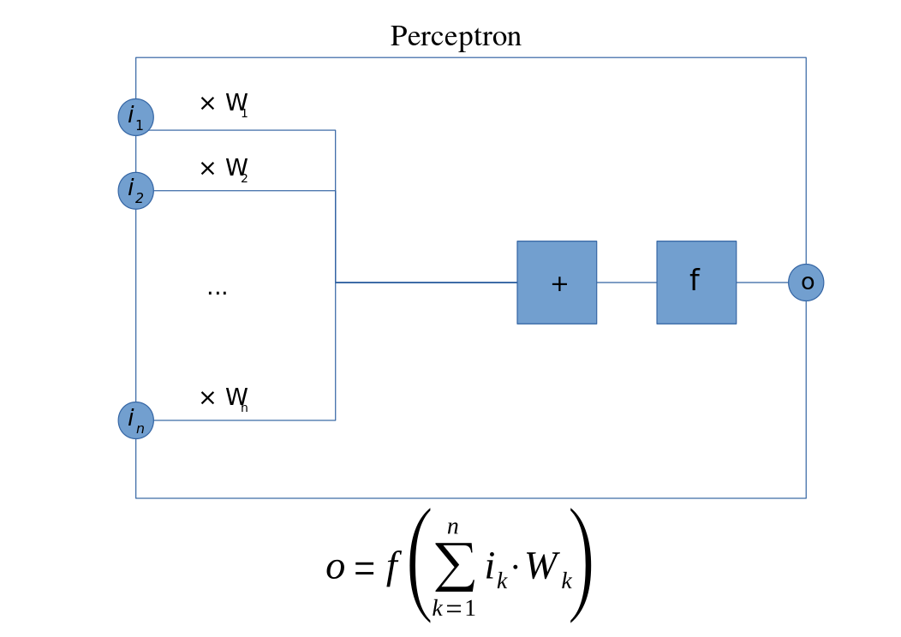
^[By Mat the w at English Wikipedia, CC BY-SA 3.0, https://commons.wikimedia.org/w/index.php?curid=23766733]
The perceptron, designed in 1957 by Frank Rosenblatt [@rosenblatt], is a supervised learning algorithm for binary classification. It maps a feature vector to the decision of whether or not the input is "true", e.g. whether or not an image contains a human face. It is inspired by the biological neuron, which "fires" when a certain threshold of input-stimulation is exceeded.

It was initially implemented as a physical machine known as the "Mark 1 Perceptron", where a 400-photocell assembly was connected to a series of potentiometers representing neural weights, numerical coefficients adding or subtracting from the probabilistic output.

As such, the single perceptron can be seen as the simplest model of a neural network, and the building block of others: an input with weights and a transformation to another feature space.

Even though it showed promise and attracted both praise and controversy (The New York Times saw it as "the embryo of an electronic computer that [the Navy] expects will be able to walk, talk, see, write, reproduce itself and be conscious of its existence."[@olazaran]), the single-layer perceptron is a very limited machine learning model, and its shortcomings caught up with the grandiose promises of its admirers. Interest and funding in neural networks declined, until it was discovered that arranging multiple perceptrons in layers would yield far greater representational power.

### The Multi-Layer Perceptron


When a feature vector is transformed by several layers comprised of multiple perceptrons with nonlinear activation functions, a truly flexible system called a multi-layer perceptron, or MLP, is achieved. This is a type of feedforward artificial neural network, meaning that the activations of a particular layer become the input for the next layer, but do not influence the values of previous layers. In essence, a MLP is a series of matrix transformations applied to an initial vector, with each intermediary result being put through a nonlinear activation function. Without the nonlinear function, the composite transformation is equivalent to a single linear transformation. With it, data that is not linearly separable can be correctly classified.[@nonlin]

MLPs achieved sufficient accuracy to be used in areas such as speech and image recognition, machine translation and regression, but once more interest waned with the advent of simpler techniques such as the SVM (support vector machines), until deep learning was more seriously explored.

### Deep Learning

Deep Learning is a broad field of machine learning where data is passed through multiple layers with various functions (unlike MLP, where each layer is a transformation of the previous) in order to create, select and use features from the initial representation. [@dengl]Feature engineering is an essential component of deep learning, since real-world data is often redundant, and given massive quantities to process, removal can be as important as processing.

Deep Learning algorithms generally[@dengl]:

  - Use multiple layers that perform nonlinear transformations, dimensionality reduction or feature engineering on the previous layer's output
  - Learn in a supervised or unsupervised fashion
  - Create a hierarchy of concepts as each layer represents an increasingly abstract and high-level feature


## Digital images

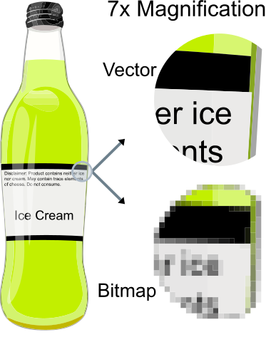
^[By The original uploader was Darth Stabro at English Wikipedia - Transferred from en.wikipedia to Commons by Pbroks13 using CommonsHelper., CC BY-SA 3.0, https://commons.wikimedia.org/w/index.php?curid=15789788]

Images can be stored digitally in two main ways:

 - Vector graphics are parametrised lists of data that describe how to recompose the image, by storing colours and sets of "X,Y" coordinates to form polygons and curves.
 - Raster images are finite lists, each describing the colour of the image in a certain point. Typically, this is in the form of a two-dimensional array of RGB (Red, Green, Blue) pixels.
 
Considering the fact that we want to use the pixels of an image as an input for several machine learning algorithms, we will be using rasterised images in formats such as **PNG** and **JPEG**.


## Convolutional Neural Networks

makes them ideal for detecting objects in various positions in images. Google, Facebook, Snapchat and other companies that deal with images all use convolutional neural networks.

^[Convolutional Neural Network. Brilliant.org. Retrieved 16:49, June 26, 2018, from https://brilliant.org/wiki/convolutional-neural-network/]

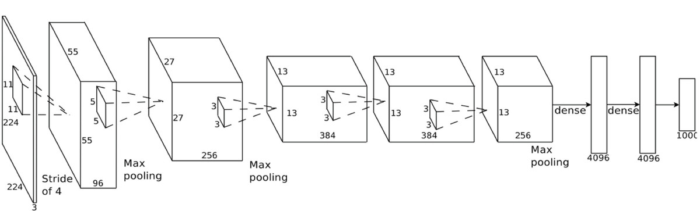

Convolutional Neural Networks, or CNNs, are a type of feed-forward deep learning neural network mostly used in image processing that require little to no preprocessing [@lecunn] and focus on relationships between pixel neighbourhoods. They analyse regions of the input and combine local features into higher-level, abstract concepts.

Aside from using conventional layers like nonlinear activations or dropout layers, there are two types of layer unique to the CNN.

### The Convolutional Layer

In a real-world application, fully-connected neural networks are not feasible for image analysis. With a medium-sized image (500x500) and a relatively low unit count (300 neurons), we're still operating with 75 million learnable parameters just on the first layer.


^[By Aphex34 - Own work, CC BY-SA 4.0, https://commons.wikimedia.org/w/index.php?curid=45659236]

The answer to this problem is the convolutional layer. It applies a convolution to the input by having each neuron only operate on a small region at a time (2x2, 5x5 etc), outputting a weighted sum or average of each region.

### The Pooling Layer

The second essential component of a CNN is the Pooling Layer, which instead of applying a learned function to a region, it simply takes the maximum or average of a group of inputs. Max-pooling, however, seems to have better performance than average pooling. [@scherer]

It is used to reduce overfitting and the quantity of redundant data produced by a convolution, since that type of layer's output volume is typically much higher than its input volume.


### GPU Use

Perhaps the most significant aspect of CNNs, at least  in the context of modern implementations, in production-level, state-of-the-art setups, is the use of the GPU in data processing. GPGPU (general-purpose computing on graphics processing units) was established in 2005[@daves], when interest grew in the area of optimising the computing effort of convolutional neural networks. Notably, one of these attempts focused on the CIFAR-10 dataset, which was used to benchmark the performance of this thesis' project.

### Shortcomings

CNNs are very well-suited to image processing, as the assumption that an image's information is stored in the relationships between its pixels is often well-founded. As a core feature, it automates previously hand-engineered features, and portions of the network can be used in "transfer learning": using pre-trained "stubs" of previously trained networks to save up on training new models.

However, there are several shortcomings that a CNN often displays:

 - **Fixed input sizes** are a result of the first convolution being applied to a fixed-size multidimensional array. Images often need to be padded, cropped or resized to fit the first layer.
 - **Training times** for CNNs are often very long, as many parameters need to be learned, from the neural weights themselves to the convolutional parameters.
 - It is unrealistic for a low-power processor to perform CNN operations. A device that performs neural image processing often **requires high-powered hardware**. Even most computers need to configure using the **GPU** for manageable CNN use.
 - Although the image requires little pre-processing, **testing times** can also be high, as the image flows through what is often a very deep network before a probabilistic result can be obtained.
 - The new operation types introduced by CNNs result in **complex architectures** that can be difficult to plan out beforehand or interpret.


# Proposal

## Benefits of a lighter network

A more lightweight image recognition algorithm would address several problems presented by complex CNNs.

First of all, real-world data comes in a variety of shapes and sizes. While cropping and resizing can provide a way to fit to an input size, information is inevitably lost in these processes before analysis can even start. It can be preferrable to use data from a variety of sources, such as web-scraping where inputs are largely unpredictable or random frames from various videos. A variety of data can allow for better stress-testing of new models.

Second, long training times may not be a problem for most commercial, highly engineered setups, but it can stifle experiments and rapidly iterated models, especially before a concrete architecture can be established. Innovation comes not from bulky, state-of-the-art systems, but from individuals experimenting on low-powered machines. Training times of hours or days discourage an experimental, prototype-oriented approach to deep learning. Also, low-powered devices that might train "live" on new objects without prior data, such as smart-glasses being tuned to a new object, need to rapidly adapt to their environment.

Third, it can be useful to reduce the computing effort necessary for testing a single image, or at least move it in a pre-processing stage. Rapid testing times can assist low-powered devices, as mentioned before with smart-watches, or high-speed recognition such as traffic cameras or those on self-driving cars, at least as a pre-emptive testing method that can decide if deeper investigation is necessary (a light network giving a probability above a certain threshold triggers the activation of a more complex CNN-like setup). Even if the effort stays the same, it can be split into pre-processing and testing. By storing images as a highly compressed, reduced dataset, they can quickly be reused in different setups. For example, if an image can be stored as a few hundred data points (as described below), a single preprocessing step's effort becomes negligible compared to the training and testing time saved on rapid iterations such as experimenting with hyperparameters and architectures.

Lastly, the complex architectures required in most image processing operations require learning an external library, and may not be intuitive to develop individually. By reducing the input to a small dataset, we have more flexibility in identifying a working architecture. In the project that makes the topic of this thesis, a simple network with only a few fully-connected layers achieves satisfactory performance.

## General Description

To address these shortcomings, we employ non-hierarchical clustering on pixels to greatly reduce the input data to a set of significant focus points.

By interpreting each pixel as a 5-dimensional data point (x, y position, R, G, B colour), we operate in a 5D space where we can parametrise the bearing position and colour have through a "distance multiplier".

As such, we convert the 3D format that images usually come from (or 2D in case of greyscale images) into a list of 5-tuples that we name "xyrgb" matrices. We normalise each feature to a value in the [0-1] interval, and we apply the distance multiplier to the first two columns (x and y).

The "xyrgb" dataset can now be used to create superpixels, by employing non-hierarchical clustering. Each pixel will belong to a cluster, and we use the centroids as the new dataset, in 5D space. With the main approach, each image is reduced to 5*k data points, where k is the chosen centroid count.

From the "xyrgb" format and labelling, we also have a way to reconstruct an image, which will be useful in visualising the functioning of the algorithm.

From the superpixel dataset, there are several ways we can integrate with a neural network. The first, and main approach ("cell batch") uses the batch of centroids as the input data itself. The second, "relationship batch", uses pairs of centroids with the spatial and colour distances between them as items in the dataset. The third, "relationship stream", uses these relationships one by one, resulting in single pairs being identified as "typical to" a certain class.


# Technologies and data used

## CIFAR-10

The CIFAR-10 dataset is a labelled set of images used in training machine learning and computer vision algorithms. It consists of 60.000 images representing 10 classes (airplanes, cars, birds, cats, deer, dogs, frogs, horses, ships, and trucks) of objects. The images are 32x32 RGB binary data.

### State of the art results

Several research papers are based on this dataset. Two convolution-based approaches are "Convolutional Deep Belief Networks on CIFAR-10 [@dbn]" with a 21.1% error rate and "Densely Connected Convolutional Networks [@dccn]" with a 5.9% error rate. "AutoAugment [@aaug]" reports a 1.48% error, and is the best attempt to date.

## ImageSoup

ImageSoup is a simple Python plugin meant to quickly retrieve a batch of images given a certain query. I have used ImageSoup for small-scale tests (100-200 images) on larger-resolution images. Its API is quite simple, with the sole parameters needed being a query, a number of images, and optionally an image size. In my code, there are several functions that check for image format to convert the unpredictable scraped data into 3D matrices.

```{python, eval=FALSE}
images[0] = ImageSoup().search('sun', n_images=200, image_size='medium')
images[1] = ImageSoup().search('moon', n_images=200, image_size='medium')
```

## Pickle

Pickle is another Python plugin that can store variable data in a file, to be unpacked later. This is useful for ensuring that the CIFAR-10 images, the scraped images, and any other data are stored in the final format. If conversion is done on a case-by-case basis, it is only done once, and each dataset is stored in its "clean" form in a pickle file.

When setting up a demo, it can be useful to outright store the processed labelled data for the neural network:

```{python, eval=FALSE}
# pickle data
pack = (x_train, y_train, x_test, y_test)
pickle.dump(pack, open('datapack', 'wb'))
# unpickle data
x_train, y_train, x_test, y_test = pickle.load(open('datapack', 'rb'))
```


## Superpixels

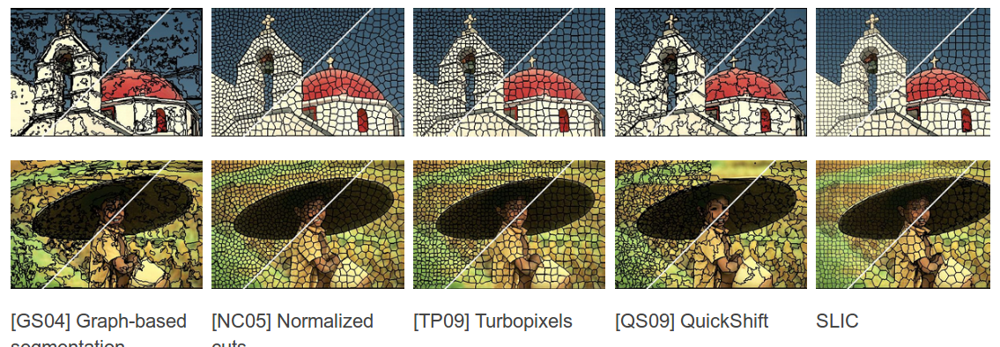

Superpixel segmentation is the process by which an image is split into groups of visual data given a certain criterion. In our case, XYRGB distance, tuned by a certain parameter, is the criterion by which a certain superpixel represents a "unit" of similar data.

Superpixels have found use in multiple computer vision algorithms. Most commonly, they are used in image segmentation to isolate a specific object (for example, a house or a person) from the background. This is useful in captioning, object recognition or even optimisation (cropping an image to the element to be analysed before processing).

### SLIC superpixels

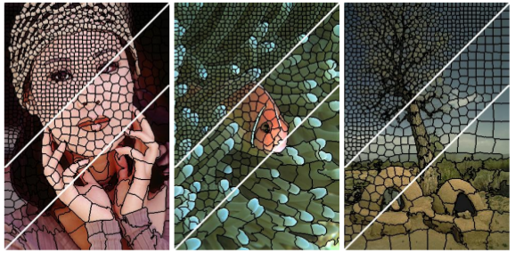

Even though we use a simple weighted XYRGB distance, there are many metrics that can be used in superpixel segmentation. As can be seen above, one of the cleanest and most easily understood methods is the SLIC [@slic] segmentation, which partially served as inspiration for this thesis.

SLIC states that while plain RGB metrics work for small distances, they do not match the way human eyes perceive colour differences. There is a threshold past which "perceptual meaningfulness" decreases. As such, SLIC uses the CIELAB colour space, where colours are defined by Lightness, and two colour components, namely red-green and yellow-blue.

SLIC superpixels tend to be quite compact and uniformly shaped, but an initial K parameter still needs to be set. This is not a problem for when we need a fixed input size, but there are methods such as the HSV-based quantization [@hsvslic] method that determine an ideal K beforehand. This improvement helps avoid under- and over-segmentation:

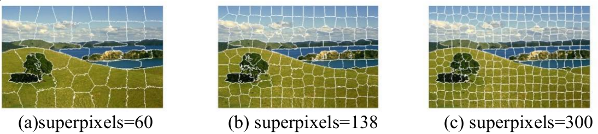

Both methods use a K-based distance metric, whereas the method described in this paper uses a distance normalised by the shortest side of the image, as described later.

## SciPy

SciPy is an open-source Python library for mathematics, science and engineering.
Its implementation of k-means is the one we use, given that it is sufficiently customisable in terms of iterations before stopping, threshold before stopping and initialisation method.

```{python, eval=FALSE}
scipy.cluster.vq.kmeans2(data, k, iter=10, thresh=1e-05, minit='random', missing='warn', check_finite=True)
```

## Keras

Keras is an open-source neural network library written in Python, meant to be a high-level wrapper around Theano, TensorFlow, among others. Its simple syntax makes it suitable for small-scale experiments and beginners, while remaining customisable and powerful.

It is a main focus of this experiment to use some of the simplest architectures possible, and as such we make use of a straight-forward sequential MLP structure. As a comparison for testing times however, we observe the performance of a CNN built in Keras as well.

# The Process

## Acquiring images

Two main databases have been used in the experiment. The first, and main source was the CIFAR-10 dataset. In its original form, CIFAR consists of 5 batches of data. The conversion to a 3D matrix is as follows:

```{python, eval=FALSE}
def pickle_to_imgs(filename):
    di = unpickle(filename)
    data = di[b'data']
    imgs = data.reshape(10000, 3, 32, 32).transpose(0,2,3,1).astype("uint8")
    labels = di[b'labels']
    return imgs, labels
```

The other way to get images was the previously mentioned ImageSoup, where data and return size was somewhat unpredictable, but also useful as a more "realistic" test (clip-art of a sun, greyscale scientific images of the solar surface, and images of a sunrise all qualified to be "sun" images). A simple "to-array" conversion was performed, as 3D is the natural form of most images.

Note: In the case of CIFAR-10, we only use two of the categories, as performance drops when contrasting between objects without significant chromatic differences (e.g. "truck" vs. "automobile" or "airplane" vs. "ship").

By the end, we have uniform data: each set is a list of 3D arrays paired with a label vector.

## XYRGB conversion

Next, we want to turn each 3D array into a list of 5-tuples describing the x and y coordinates of each vector, and the RGB values.

The width and height are taken from either the image's size or the dimensions of the 3D matrix, unified below for explanatory purposes.

**x** and **y** are shaped to be a mesh grid of the dimensions, to later cover all of the coordinate pairs in the images (the "ravel" on the last line), then divided by the shortest of the image's height and width. We do this so that the image is not "squashed" and distorted, while keeping distances relevant and faithful to the image's structure (two points on the far sides of a rectangular image are more distant than two on opposite, close-by sides).

Lastly, the RGB values are divided by 255 to be in the [0, 1] interval as well.

```{python, eval=FALSE}
w, h = img.size
img_m = np.array(img)
x, y = np.mgrid[:img_m.shape[0], :img_m.shape[1]]
x = x / min(w, h)
y = y / min(w, h)
xyrgb = np.hstack([y.ravel()[:,None], 
                x.ravel()[:,None],
                img_m.reshape((-1,img_m.shape[-1])) / 255])
```

## XYRGB to superpixels

Now we have a simple table of data points in a 5-dimensional space, similarly with other superpixel implementations. In all three attempts to create input data from this table, we use k-means to form clusters, and take the centroids as input. We use the SciPy implementation of k-means, with the centroids initialised on random data points, which helps decrease the number of empty clusters.

```{python, eval=FALSE}
xyrgb[:, 0:2] *= dmul
centroids, labels = kmeans2(xyrgb, k, minit='points', iter=iter)
```

### Dmul - The Distance Multiplier

"dmul" is a parameter by which the first two columns of the "xyrgb" table is multiplied before clustering: the spatial coordinates of each point.

In doing so, we can control how much spatial distance factors into overall similarity. Although this has a bearing on accuracy, it can first be explored through the reconstruction function, where each pixel, instead of retaining its original value, is assigned the colour of the cluster it belongs to.
```{python, eval=FALSE}
def reconstruct(w, h, centroids, labels):
    pixels = w * h
    # a tall array of r, g, b values with as many rows as pixels
    reconst = np.zeros((pixels, 3))
    for i in range(pixels):
        # get rgb value of the centroid the i-th pixel belongs to
        rgb = centroids[labels[i], 2:5] * 255
        # assign that rgb value to the pixel
        reconst[i] = rgb
    # reshape the matrix and save it as an image
    reconst = reconst.reshape((h, w, 3)).astype('uint8')

    return Image.fromarray(reconst)
```

The effect can be seen as follows, in a demonstration with very few clusters:

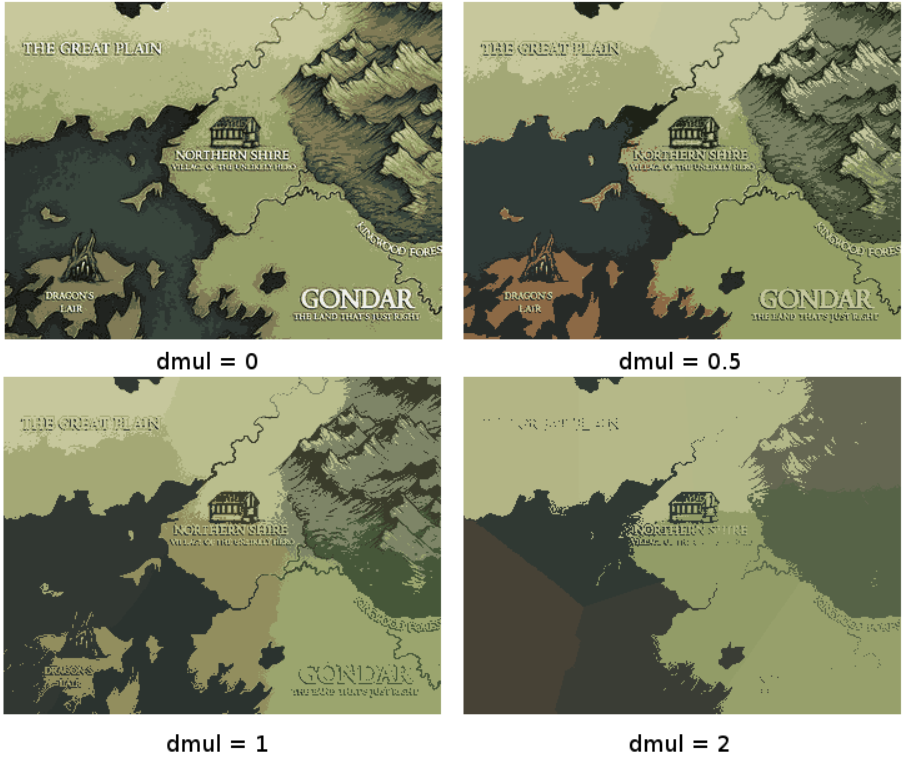


^[By Sarithus, "Map of Clichea", https://sarithus.deviantart.com/art/Map-of-Clichea-532220700]

With `dmul=0`, the clustering is essentially done purely on the colours. This picks out the "main" colours of the image with no regard to XY space.

A low `dmul=0.5` still prioritises colour distances, but prefers to integrate pixels with a similar colour from further away, preserving finer features like text.

`dmul=1` seems to offer the most consistent performance, taking into account both space and colour equally.

`dmul=2` or higher starts ignoring colour, and basically overlays a uniform Voronoi map over the image and takes the average of the area. High dmul values offer unreliable accuracy that seems to depend too much on random chance.

Below we see a reconstruction of the same image with several k values.

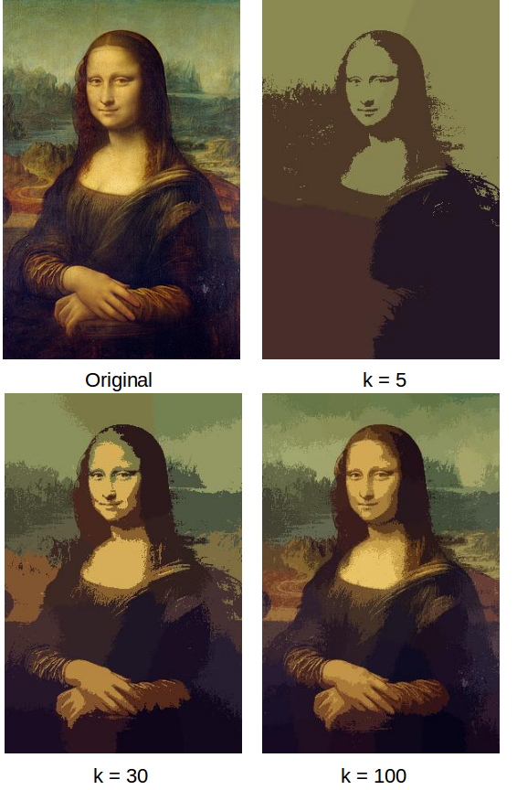

## Superpixels to neural input

### Cellbatch

In the **Cellbatch** approach, the centroids are simply a list of 5-tuples in a random sequence. Used plainly as the input for the neural network, this produces unsatisfactory results, but ordering by "brightness" (the R+G+B sum) leads to sufficient performance for the experiment. The clusters are ordered, and flattened into an input of size k*5 (k superpixels, each with [x, y, r, g, b]). The target is a one-hot vector (a vector of zeroes with a 1 on the target class' index).

### Rel-batch

The second experiment takes a parameter named "quantity", the number pairs of centroids picked randomly, computes two Euclidean distances (XY distance, RGB distance), and then removes the initial XY coordinates.

```{python, eval=FALSE}
for i in range(quantity):
    first, second = random.choice(centroids), random.choice(centroids)
    first_xy, first_rgb = first[0:2], first[2:5]
    second_xy, second_rgb = second[0:2], second[2:5]
    xy_dist = np.linalg.norm(first_xy - second_xy)
    rgb_dist = np.linalg.norm(first_rgb - second_rgb)
    
    if np.sum(first_rgb) < np.sum(second_rgb):
        first_rgb, second_rgb = second_rgb, first_rgb
    x[i] = [*first_rgb, *second_rgb, xy_dist, rgb_dist]
```

As such, each pair is in the following format: `[r1, g1, b1, r2, g2, b2, xy_dist, rgb_dist]`

A graphical example of a pair selection:

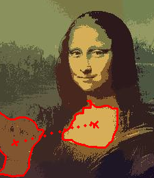

The input is a flattened list of pairwise relationships, of total size quantity*8, and the target is a single one-hot vector.

### Rel-stream

The third attempt calculates pair-elements like before, `[r1, g1, b1, r2, g2, b2, xy_dist, rgb_dist]`, except rather than flattening the input, each pairwise relationship is taken as a single input of size 8, with a one-hot vector output.

This means that an image is not associated with a certain number of relationships, but rather is used as a source of information and discarded. Essentially, an image of a rainbow might result in information such as "orange superpixels tend to be close to other orange superpixels" as well as "green superpixels can be found next to yellow and blue superpixels, but not purple ones". To test an image, we extract relationships from it, feed each into a neural network, and sum up the outputs, as each relationship informs the final decision individually.

## The neural network

As stated previously, one of the goals of this experiment is to use a simple, small and straight-forward architecture for the neural network employed by any of the three input data formats.

The architecture used is a MLP with three hidden layers of 300 neurons each:

```{python, eval=FALSE}
model = Sequential()
model.add(Dense(300, activation='relu', input_shape=(x_train.shape[1],)))
model.add(Dense(300, activation='relu'))
model.add(Dense(300, activation='relu'))
model.add(Dense(300, activation='relu'))
model.add(Dense(y_train.shape[1], activation='softmax'))
```

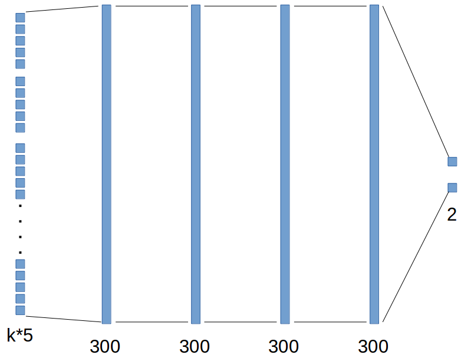

The data is split into 75% training data and 25% testing data:
```{python, eval=FALSE}
cutoff = (x_arr.shape[0] * 3) // 4
x_train = x_arr[0:cutoff]
y_train = y_arr[0:cutoff]
x_test = x_arr[cutoff:]
y_test = y_arr[cutoff:]
```

We use the RMSprop optimiser built into Keras, that minimises cross-entropy.
```{python, eval=FALSE}
model.compile(loss='categorical_crossentropy',
                optimizer=RMSprop(),
                metrics=['accuracy'])
```

## Benchmark - Flat

To prove that the methods used are improvements upon a fully-connected image-processing network, a benchmark test is run using the flattened image as input to a network.

# Test Results

The best results were obtained by the simplest method, namely "Cellbatch", followed by "Relbatch" and "relstream" (this method yielded unstable accuracies, ranging from close to 90% on random scraped images from chromatically different classes, to under 50% on CIFAR two-class testing. Although this was the first method attempted, it mostly served to form the "Relbatch" approach, not yielding conclusive results in itself).

The analysis will be focused on the first two approaches, as well as how they compare to the CNN and the "flat" network where an image is directly used as input.

## CIFAR two-class

The tests are run as follows: CIFAR images corresponding to the "frog" and "ship" classes are processed by each algorithm with the same parameters and conventions:

 - k = 30
 - quantity (for Relbatch) = 900
 - batch size for training networks = 1000
 - epochs of training = 20
 - images = 10000, 7500 training, 2500 testing
 - "pre-processing time" refers to the time needed to take an image to neural input form, whereas "testing time" refers to the time it takes for one datapoint to pass through the neural network
 
### Flat

The "flat" algorithm performed the most poorly. Although pre-processing time is insignificant, training took 31 seconds and each image took 0.0002 seconds to test, higher than both experiments. Most importantly, accuracy hovers around 50% for two-class recognition, making it a useful "ground zero" standard.

### Cellbatch

This algorithm performed best, and illustrates the initial hypotheses well: short preprocessing and testing time (that summed up give us a quicker test time than the CNN), acceptable accuracy for a first experiment round, and lightweight architecture that took a very short time to train.

Each image took 0.0015 s to preprocess, and 0.00005 s to test. Summed up, the time to preprocess and test an image is around 13 times less than what a CNN needs for a single test. Accuracy averages out around 85%, and the training time was only 5 seconds.

It's worth noting that with some tweaking of batch size and epoch count, accuracies of ~90% can be consistently reached within 10 seconds of training. On full-scale tests however, with all 10 classes, accuracy converges at 33%:

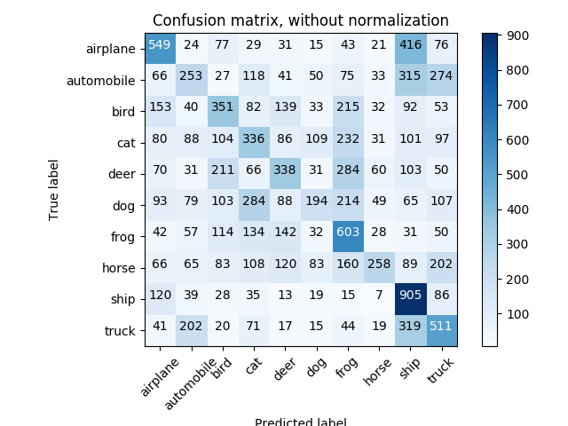

### Relbatch

Using relationships between pairs of centroids didn't change the results of "Cellbatch" by much, but still seems to be an idea worth exploring.

Preprocessing time was 0.09 s, whereas testing time was 0.0001 s. The network was around 86% accurate, but took 31 s to train, about as much as the flat algorithm.

### CNN

The CNN understandably took no time to preprocess an image, but required 0.02 s for each test, which is around 13 times more time than "Cellbatch" needed with preprocessing included. Accuracy testing was not conclusive, as the hardware used in the rest of the testing was not sufficient to operate the CNN.

### Visual summary

Overall, in two-class CIFAR-10, the flat algorithm had the quickest total image processing time, but provided poor accuracy. The Cellbatch method, with its ~87% accuracy, confirms the tradeoff assumed in the proposal.

Not pictured are training times, as the CNN takes at least an hour to train, compared to Cellbatch's 5 seconds and Relbatch/flat's 31.

```{r, echo=FALSE}
library(ggplot2)
library(dplyr)
library(tidyr)

alg_name <- c('Cellbatch', 'Relbatch', 'cnn', 'flat')
prep_time <- c(0.0015, 0.09, 0, 0)
test_time <- c(0.00005, 0.0001, 0.02, 0.0002)
cifar_times <- data.frame(alg_name, prep_time, test_time)

cifar_tall <- cifar_times %>%
    gather(task, val, -alg_name)

cifar_tall %>% 
    group_by(alg_name) %>%
    ggplot(aes(x = alg_name, y = val, fill = task)) +
    geom_bar(stat = 'identity', position = 'stack') +
    ggtitle('Time taken by task and algorithm') + 
    xlab('Algorithm') +
    ylab('Time(s)') +
    scale_fill_manual(values=c("#aabbcc", "#ee9900"))
```

## Sun/moon scraped images

Testing was done on a smaller scale using scraped images with the queries "sun" and "moon", and image sizes of around 300 by 400 pixels.

Given that the input size varied, only the k-means-based methods were tested here, highlighting the way they can handle irregular data.

In the case of bigger images, the extra time taken by Relbatch to form pairs and select them was dwarfed by how long the clustering took. The accuracy and test time were similar to CIFAR-10 two-class:

 - Cellbatch took 0.68 s preprocessing time per image, whereas Relbatch took 0.71 s
 - Training and testing times were understandably the same, as data size is identical (0.00005 s for Cellbatch, 0.0001 for Relbatch)
 - Accuracy for both algorithms was 82%

Optimising the k-means algorithm, perhaps in the manner that SLIC segmentation works, namely reducing the search space for clustering to twice the average cluster size, would most likely lead to proper scaling in the preprocessing step.

# Analysing and optimising "Cellbatch"

Next, several analyses were performed to study the relationships between various parameters, timing and fidelity.

## Iteration count

The iteration parameter for the k-means algorithm influences pre-processing time in a linear fashion, as expected:

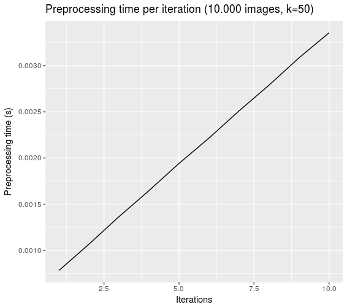

However, it would seem that there is no point in increasing iteration cound above 4, given the way the purpose of the algorithm: selecting essential pixels rather than a completely accurate segmentation. In a concrete sense, accuracy beyond 2 iterations stays roughly the same, and segmentation converges visually after two iterations:

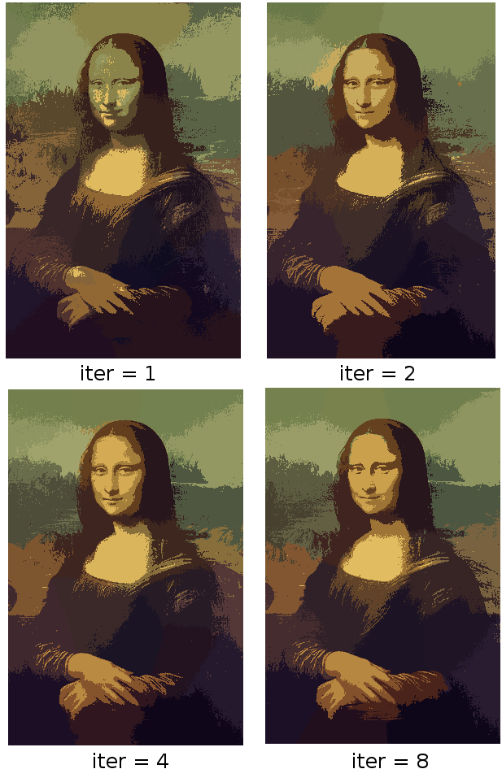

## Cluster count (K)

Similarly, K influences pre-processing time, although in a less linear fashion. Accuracy is acceptable across most values, but it can be attributed to coincidence at lower values: the lower the K value, the more random the accuracy of a single test.

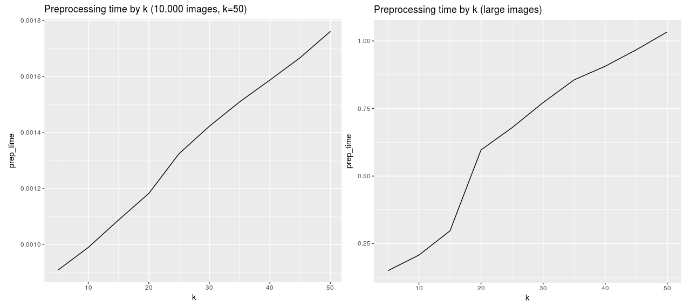

Training time is similarly affected by k:

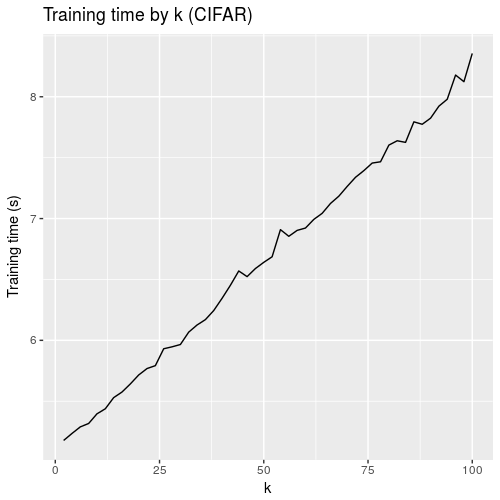

# Further work

There are still several shortcomings of the algorithm.

First off, the algorithm is based on areas of colour, encoding entire images into a few dozen or hundred pixels. Data about edges and sharper features, like in CNNs, is lost in favour of data reduction. As such, images of a similar class, but different colour, get classified wrong, as do images that are chromatically similar but represent different classes. Smaller superpixels with better adjacency information could help remedy the problem.

For smaller superpixels we need to optimise the segmentation process, as is done in SLIC. A custom clustering algorithm with a limited search space for each pixel would need to be implemented.

Also, although Relbatch provides pairwise information, it is a rough relative positioning. Another way, as mentioned previously, would be to provide only pairs of adjacent superpixels. If providing "chunks" of the image as input, rotational data could provide some structure too (e.g. "are the three or more superpixels in a line or in a triangular shape?").

The actual content of the superpixels themselves could be of use. Instead of averaging out to a centroid, we could use cluster analysis to provide more data about the internal composition of a "cell". Uniform, single-colour superpixels would be statistically different from those on a gradient or that encompass smaller features. The edges of each cell can be utilised better, as well, or at least the general shape: we observe a lot of superpixels "circling around" and engulfing others, thus overlapping the centers in two dimensions. A high RGB distance coupled with a low XY one is transmitted in Relbatch, but it's not representationally different from two long clusters side by side.

# Conclusions

To conclude, the experimental approach delivers on the initial premises: 

 - Satisfactory accuracy for a first attempt, with accuracies varying between 82% to 90%, depending on parameters and test case
 - Substantial data reduction
 - Greatly reduced training and testing times
 - Moving computing effort to preprocessing
 - Rapid performance on CPU, on older systems

Out of the approaches used, the simplest one, Cellbatch, provides the best balance between processing time and accuracy, given an appropriate data set. The baseline of a fully-connected image-to-neural-network system proves that the algorithm filters out noise in its preprocessing step, and the Relbatch approach hints at directions for further research.


# References
